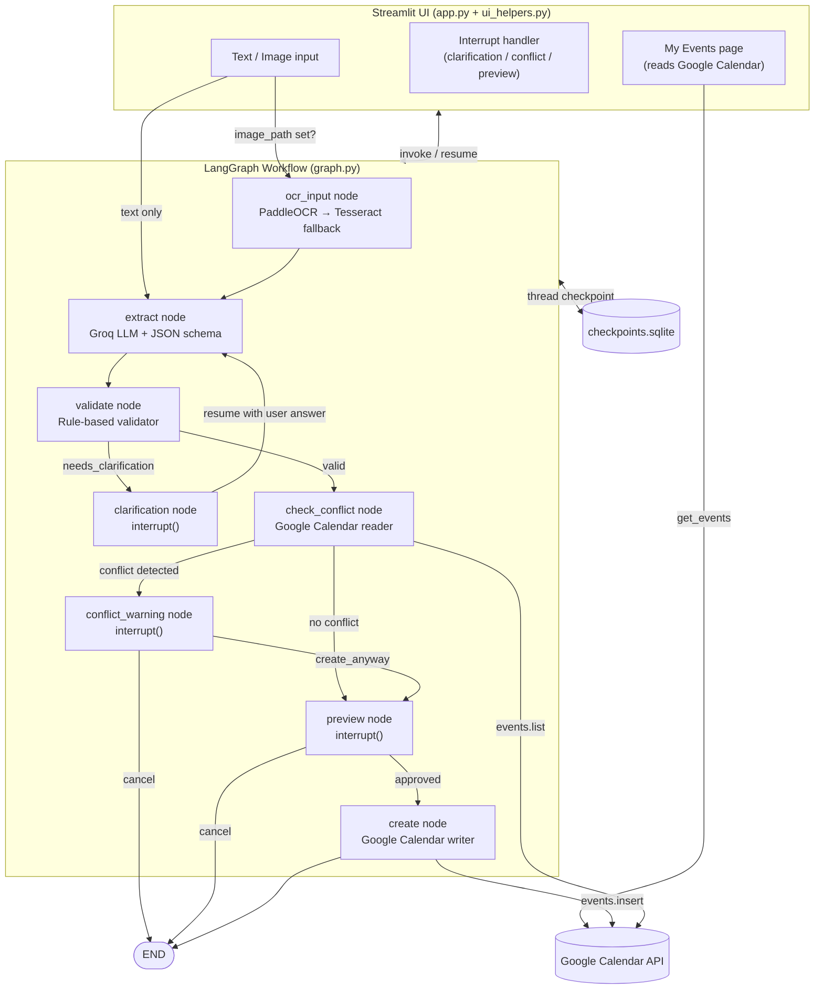

# Snap2Schedule

Snap2Schedule converts natural-language text or screenshots into structured Google Calendar events. The user provides a description of an event (typed or as an image), and the system runs it through an LLM-based extraction pipeline, validates the result, checks for scheduling conflicts, asks for user confirmation, and creates the event in Google Calendar.

---

## Problem

Manually entering calendar events is friction. Users often have event information in unstructured forms — a text message, a meeting note, a screenshot of a chat conversation. The core challenge is bridging the gap between informal human language and the structured data required by calendar APIs:

- **Input**: Free-form Vietnamese or English text, or a screenshot containing event-related text
- **Expected output**: A calendar event in Google Calendar with the correct title, date, time, and location
- **Technical challenges**:
  - Resolving relative temporal expressions ("tomorrow", "thứ 6 tới", "2h chiều") against a current datetime anchor
  - Handling missing fields (no end time specified) vs. truly invalid data (end before start)
  - Detecting scheduling conflicts against existing calendar data before committing
  - Supporting multi-turn clarification when extracted information is incomplete

**Not in scope**: Multi-user support, recurring events, attendee management, and reminders are not implemented.

---

## Solution Overview

```
User Input (text or image)
       │
       ▼
  Streamlit UI
       │
       ▼
  LangGraph Workflow
       │
  ┌────┴────────────────────────────────┐
  │ [ocr_input]  ← image path present   │
  │     │                               │
  │ [extract]  ← Groq LLM (JSON schema) │
  │     │                               │
  │ [validate] ← rule-based checks      │
  │     │                               │
  │ [clarification] ← interrupt (UI)    │
  │     │                               │
  │ [check_conflict] ← Google Calendar  │
  │     │                               │
  │ [conflict_warning] ← interrupt (UI) │
  │     │                               │
  │ [preview] ← interrupt (UI)          │
  │     │                               │
  │ [create] → Google Calendar API      │
  └─────────────────────────────────────┘
```

---

## Architecture

### Component Table

| Component | Module | Responsibility |
|-----------|--------|---------------|
| Streamlit UI | `app.py`, `ui_helpers.py` | Layout, input handling, interrupt rendering, navigation |
| LangGraph workflow | `graph.py` | Compiles the state machine; manages interrupts and checkpointing |
| State | `state.py` | `CalendarState` TypedDict shared across all nodes |
| Nodes | `nodes.py` | One function per workflow step |
| Routing | `routing.py` | Pure functions deciding conditional edges |
| Extraction | `extractor.py` + `prompts/event_extraction.py` | Calls Groq API with structured JSON schema output |
| Validation | `validator.py` | Rule-based check for missing required fields and logical errors |
| Clarification | `clarification.py` | Builds clarification question from validation errors |
| OCR — primary | `paddleocr_tool.py` | PaddleOCR v3 with Vietnamese language model |
| OCR — fallback | `tesseract_tool.py` | Tesseract (English) used when PaddleOCR fails or confidence < 0.85 |
| Calendar reader | `calendar/calendar_reader.py` | Fetches events in a time window for conflict detection |
| Calendar writer | `calendar/calendar_writer.py` | Creates a new event via Google Calendar API |
| Conflict checker | `calendar/conflict_checker.py` | Pure overlap detection (interval comparison) |
| Auth | `calendar/auth.py` | Loads OAuth2 credentials from `token.json` |
| Config | `config.py` | Reads `GROQ_API_KEY` from `.env`; sets LLM model |
| Error types | `errors.py` | `OCRServiceError`, `CalendarServiceError`, `CalendarTimeoutError` |
| Checkpointer | `checkpoints.sqlite` | SQLite-backed LangGraph checkpoint store |

### Architecture Diagram



The Streamlit layer is primarily responsible for presentation and user interaction. It calls `graph.invoke()` on first submission and `graph.invoke(Command(resume=...))` on each interrupt response. Workflow decisions and event-processing logic are handled by the LangGraph and service layers. All graph state is persisted in the SQLite checkpointer per `thread_id`; however, `thread_id` is stored in `st.session_state` and is not recovered after a browser hard refresh — a new session begins with a fresh UUID.

---

## Workflow / Graph

### State

`CalendarState` (TypedDict in `state.py`):

| Field | Type | Purpose |
|-------|------|---------|
| `user_input` | `str` | Raw text (or OCR output); can be appended during clarification |
| `image_path` | `str \| None` | Path to uploaded image; triggers OCR branch |
| `raw_text` | `str` | Text extracted by OCR engine |
| `ocr_confidence` | `float` | Average confidence score from OCR |
| `ocr_engine` | `str` | `"paddleocr"` or `"tesseract"` |
| `extracted_event` | `ExtractedEvent` | Pydantic model from LLM extraction |
| `validation_result` | `ValidationResult` | Status + error codes + missing fields |
| `clarification_message` | `str` | Question shown to user for clarification |
| `preview_message` | `str` | Confirmation prompt shown before creation |
| `approval` | `bool` | User's response to preview |
| `conflict` | `bool` | Whether a calendar conflict was found |
| `conflict_message` | `str` | Description of conflicting event |
| `create_anyway` | `bool` | User's decision at conflict warning |
| `event_id` | `str` | Google Calendar event ID after creation |

### Nodes

**`ocr_input_node`** — Runs PaddleOCR (Vietnamese, `PP-OCRv6_medium`) on the image. If confidence ≥ 0.85, returns immediately. Otherwise falls back to Tesseract. If both fail, raises `OCRServiceError`. Sets `user_input`, `raw_text`, `ocr_confidence`, `ocr_engine`.

**`extract_event_node`** — Calls Groq API with model `openai/gpt-oss-120b`, using structured JSON output matching `ExtractedEvent.model_json_schema()`. System prompt includes the current datetime, timezone (`Asia/Ho_Chi_Minh`), and weekday to resolve relative expressions. Returns `extracted_event`.

**`validate_event_node`** — Rule-based: checks that `title`, `start_date`, and `start_time` are present; checks for `END_DATE_BEFORE_START_DATE` and `END_TIME_BEFORE_START_TIME`. Returns `ValidationResult` with status `valid | needs_clarification | invalid`.

**`clarification_node`** — Calls `interrupt()` with a question derived from missing/invalid fields. Appends the user's response to `user_input` as additional context before looping back to `extract`.

**`check_conflict_node`** — Queries `calendar.events.list` for the event's time window. Uses interval overlap (`max(start, ev_start) < min(end, ev_end)`). If `end_time` is missing, defaults to `start + 1 hour`.

**`conflict_warning_node`** — Calls `interrupt()` asking the user whether to proceed despite the conflict. Sets `create_anyway`.

**`preview_event_node`** — Calls `interrupt()` with a summary of the event for user approval. Sets `approval`.

**`create_event_node`** — Calls `calendar.events.insert` with the structured event data. If `end_time` is missing, defaults to `start + 1 hour`. Returns `event_id`.

### Routing

| Router function | Decision |
|----------------|----------|
| `route_after_ocr_input` | `image_path` present → `ocr_input`; else → `extract` |
| `route_after_validation` | `status == "valid"` → `check_conflict`; else → `clarification` |
| `route_after_conflict` | `conflict == True` → `conflict_warning`; else → `preview` |
| `route_after_conflict_warning` | `create_anyway == True` → `preview`; else → `END` |
| `route_after_approval` | `approval == True` → `create`; else → `END` |

### Termination

The workflow ends at `END` in three cases: user cancels at conflict warning, user rejects the preview, or event creation succeeds.

### Retry / Fallback

- OCR: PaddleOCR → Tesseract fallback, implemented in `ocr_input_node` with a `try/except` block.
- A generic `retry()` utility exists in `retry.py` (max 1 retry by default) but is not wired into the graph nodes as of the current implementation.
- `check_conflict_node` and `create_event_node` both default missing `end_time`/`end_date` to `start + 1 hour` rather than crashing.

---

## Project Structure

```text
Snap2Schedule/
├── main.py                         # CLI entry point (dev/testing use)
├── requirements.txt                # Pinned top-level deps
├── .env.example                    # GROQ_API_KEY placeholder
├── checkpoints.sqlite              # LangGraph SQLite checkpoint store
├── background.png                  # UI background image
│
├── src/snap2schedule/
│   ├── app.py                      # Streamlit entry point
│   ├── graph_runner.py             # Graph invocation & resume helpers
│   ├── __main__.py                 # Python module execution point
│   ├── session.py                  # Streamlit session initialization
│   ├── ui/                         # UI layout and components package
│   ├── pages/                      # Page logic (home, my_events) package
│   ├── nodes/                      # Graph nodes package (ocr, extract, calendar)
│   ├── ui_helpers.py               # CSS injection, safe_html, base utils
│   ├── graph.py                    # LangGraph graph definition + compilation
│   ├── state.py                    # CalendarState TypedDict
│   ├── routing.py                  # Conditional edge functions
│   ├── extractor.py                # Groq API call for event extraction
│   ├── validator.py                # Rule-based validation
│   ├── clarification.py            # Builds clarification questions
│   ├── schema.py                   # Pydantic models (ExtractedEvent, etc.)
│   ├── config.py                   # Reads GROQ_API_KEY from .env
│   ├── llm_client.py               # Groq client singleton
│   ├── paddleocr_tool.py           # PaddleOCR wrapper (primary OCR)
│   ├── tesseract_tool.py           # Tesseract wrapper (fallback OCR)
│   ├── image_preprocess.py         # Image preprocessing utilities
│   ├── time_context.py             # Timezone-aware current datetime for prompts
│   ├── errors.py                   # Custom exception hierarchy
│   ├── retry.py                    # Generic retry utility
│   ├── trace.py                    # Structured stdout tracing per node
│   ├── prompts/
│   │   └── event_extraction.py     # EXTRACTION_SYSTEM_PROMPT (Vietnamese)
│   └── calendar/
│       ├── auth.py                 # OAuth2 credential loading
│       ├── calendar_reader.py      # events.list wrapper
│       ├── calendar_writer.py      # events.insert wrapper
│       ├── conflict_checker.py     # Interval overlap check
│       └── reauth.py              # CLI tool to refresh expired OAuth token
│
└── tests/                          # Pytest test suite (18 test files)
    ├── test_e2e_v0.py
    ├── test_regression_v1.py
    ├── test_conflict_flow.py
    ├── test_approval_flow.py
    ├── test_ocr_e2e.py
    └── ...
```

---

## Tech Stack

| Technology | Version | Role |
|-----------|---------|------|
| Python | Tested with 3.13.2 | Core language |
| Streamlit | 1.63.0 | Web UI framework |
| LangGraph | 1.2.11 | Stateful workflow graph with interrupt/resume |
| Groq SDK | 1.6.0 | LLM API client |
| LLM Model | `openai/gpt-oss-120b` (via Groq) | Event extraction with structured JSON output |
| PaddleOCR | 3.7.0 | Primary OCR engine (Vietnamese, `PP-OCRv6_medium`) |
| PaddlePaddle | 3.3.1 | PaddleOCR runtime |
| Pytesseract | 0.3.13 | Fallback OCR engine |
| Pydantic | 2.13.4 | Data validation and JSON schema generation |
| google-api-python-client | 2.200.0 | Google Calendar API v3 |
| google-auth / google-auth-oauthlib | (transitive) | OAuth2 credential management |
| python-dotenv | 1.2.3 | `.env` loading |
| SQLite (stdlib) | — | LangGraph checkpoint persistence |

---

## Setup

### Prerequisites

- Python 3.10 or later (tested with 3.13.2; no explicit minimum is declared in the project)
- A **Groq API key** — [console.groq.com](https://console.groq.com)
- A **Google Cloud project** with the Calendar API enabled and OAuth2 credentials downloaded as `credentials.json`
- Tesseract installed and on `PATH` if OCR fallback is required (Tesseract installation is OS-specific)

### Clone

```bash
git clone <repository-url>
cd Snap2Schedule
```

### Virtual Environment

```bash
python -m venv .venv

# Windows
.venv\Scripts\activate

# macOS / Linux
source .venv/bin/activate
```

### Install Dependencies

```bash
pip install -r requirements.txt
```

### Environment Variables

Create a `.env` file in the project root:

```env
GROQ_API_KEY=your_groq_api_key_here
```

### Google Calendar Authentication

Place your OAuth2 client credentials file at:

```
src/snap2schedule/credentials/credentials.json
```

Then run the authentication script to generate `token.json`:

```bash
python src/snap2schedule/calendar/reauth.py
```

This opens a browser for Google login and saves the token. `auth.py` does not perform automatic access-token refresh at runtime. If the token becomes invalid (expired refresh token or revoked access), run `reauth.py` again.

> **Security note**: The following files contain secrets or runtime artifacts and must not be committed to version control:
> - `.env` — Groq API key
> - `src/snap2schedule/credentials/credentials.json` — Google OAuth2 client secret
> - `src/snap2schedule/credentials/token.json` — OAuth2 access/refresh tokens
> - `checkpoints.sqlite` — may contain user input in checkpoint data

---

## Running the Application

```bash
python -m snap2schedule
```
Alternatively, you can run it directly with Streamlit:
```bash
streamlit run src/snap2schedule/app.py
```

The app is available at `http://localhost:8501`.

> **Important**: Run from the project root (`Snap2Schedule/`).

---

## Demo

### Example: Text input

**Input**

```
Mai 2h chiều họp team ở B201 khoảng 1 tiếng, review OCR sprint.
```

**Processing flow**

1. `extract` node → Groq resolves "mai" to tomorrow's date, "2h chiều" to 14:00, derives end_time 15:00
2. `validate` node → all required fields present, no logical errors → status `valid`
3. `check_conflict` node → queries Google Calendar for the 14:00–15:00 window
4. If no conflict → `preview` node pauses and shows event summary in UI
5. User clicks **Approve & create**
6. `create` node → calls `calendar.events.insert`, returns event ID
7. UI shows success card with link to Google Calendar

### Example: Screenshot input

**Input**: Upload an image of a chat message or document containing event details.

**Processing flow**

1. `ocr_input` node → PaddleOCR extracts text with confidence score
2. If confidence ≥ 0.85: proceeds to `extract`; otherwise tries Tesseract
3. Remaining flow identical to text input
4. UI shows OCR confidence badge (green ≥ 80%, yellow ≥ 60%, red below)

### Clarification example

If the user types only `"Họp với Minh"` (no date or time), the `validate` node marks `start_date` and `start_time` as missing. The `clarification` node pauses and asks the user for the missing information. The user's response is appended to the original input and extraction is re-run.

---

## Key Design Decisions

**1. LangGraph interrupt for human-in-the-loop steps**

Rather than managing a custom multi-step state machine in Streamlit session state, the graph uses LangGraph's `interrupt()` mechanism for clarification, conflict warning, and final approval. This keeps the approval logic inside the graph where it belongs, and makes the flow observable and resumable via the SQLite checkpoint.

**2. Structured JSON output from the LLM**

The extraction prompt uses `response_format` with `json_schema` tied directly to `ExtractedEvent.model_json_schema()`. This eliminates prompt-engineering for output parsing and makes the extraction schema self-documenting through Pydantic.

**3. Separation of extraction and validation**

The `extract` node is intentionally non-validating: it captures whatever the LLM extracts (including contradictory data like end before start). The `validate` node applies rule-based checks separately. This means the LLM prompt does not need to encode business rules, and validation logic is testable independently.

**4. OCR with confidence-based fallback**

PaddleOCR runs first with a Vietnamese model. If confidence falls below 0.85, Tesseract is attempted. The OCR engine name and confidence score are surfaced in the UI via a badge, giving the user transparency about input quality.

**5. Time context injected into prompts**

`TimeContext` computes the current datetime in `Asia/Ho_Chi_Minh` timezone and injects it into the extraction system prompt. This allows the LLM to resolve relative expressions ("tomorrow", "thứ 6", "cuối tuần") correctly without hardcoding date logic in application code.

**6. SQLite checkpointing for session continuity**

LangGraph's `SqliteSaver` persists the full workflow state between Streamlit reruns within the same session. Each browser session generates a UUID as `thread_id` stored in `st.session_state`. This enables interrupt/resume behavior across Streamlit reruns, but `thread_id` is not recovered after a browser hard refresh — a new UUID is generated and a fresh workflow begins.

---

## Trade-offs and Limitations

| Decision | Benefit | Trade-off |
|----------|---------|-----------|
| Streamlit as UI | Fast iteration; no frontend build tooling | Limited widget customization; full script re-execution on every interaction; no real routing |
| Groq API for extraction | Fast inference; structured output support | External dependency; latency per request; API key required; model name `openai/gpt-oss-120b` is a Groq-hosted model not the public OpenAI API |
| SQLite checkpoint (single file) | Zero-infrastructure persistence; works locally | Not suitable for concurrent users or deployment across multiple processes |
| PaddleOCR with Vietnamese model | High accuracy on Vietnamese text | Large model files downloaded on first run; GPU not used by default (`enable_mkldnn=False`) |
| `end_time` fallback to `start + 1 hour` | Prevents crashes on underspecified input | User may not notice the assumed duration; no UI warning currently shown |
| OAuth2 token stored in `token.json` | Simple local auth flow | Token expires; requires manual re-running of `reauth.py`; not suitable for multi-user or cloud deployment |


---

## Future Improvements


- **Multi-user support**: Replace the SQLite checkpointer with a database-backed store and scope `thread_id` to authenticated users.
- **Persistent event history**: The "History" and "My Events" pages currently read live from Google Calendar. A local event log would enable offline access and filtering without API calls.
- **End-time confirmation in UI**: When `end_time` falls back to `start + 1 hour`, the preview card should explicitly show the assumed duration so users can catch it before creation.
- **Async OCR**: PaddleOCR initialization is synchronous and blocks the Streamlit process. Moving it to a background task or caching the model instance would improve startup time.
- **Test coverage for nodes**: Most existing tests cover end-to-end graph flows. Unit tests for individual nodes (especially `check_conflict_node` and `create_event_node`) would improve maintainability.
- **Token refresh in app**: Rather than requiring manual `reauth.py` runs, the app could detect an expired token and trigger a re-authentication flow inline.